# 100 Days of SwiftUI Project 17

## HotProspects

**App Description:**  App for recording the interactions with contacts at a Conference using QRCodes.

**Swift Features Used:**
Using the Documents directory, or User Defaults to save and retrieve contact data, custom environment objects, TabView, Result, objectWillChange, image interpolation, context menus, local notifications, Swift Package Manager, filter() and map().

**Screenshots:**

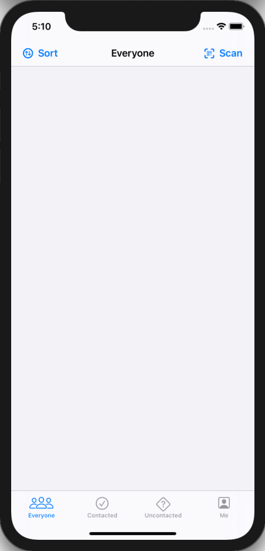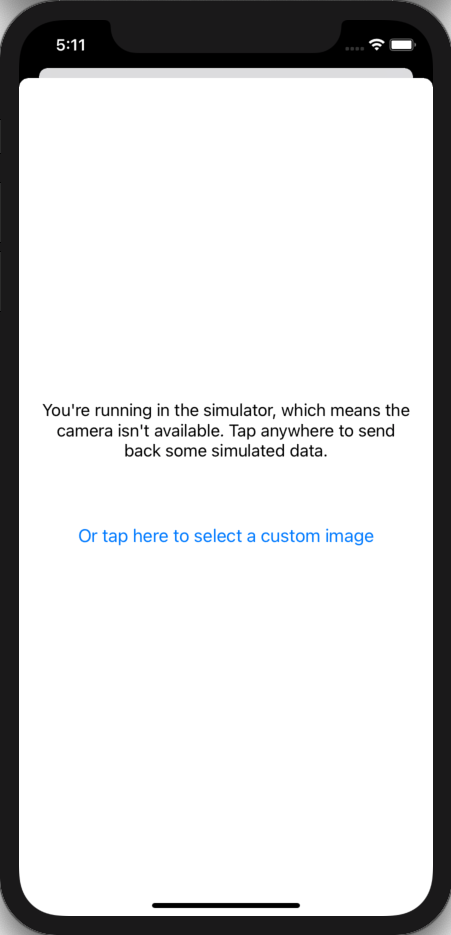
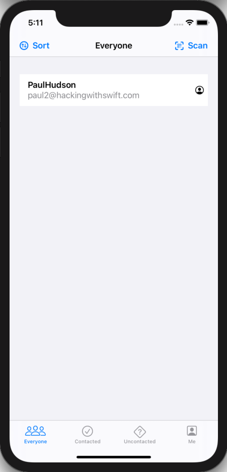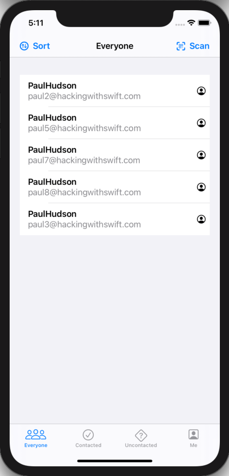
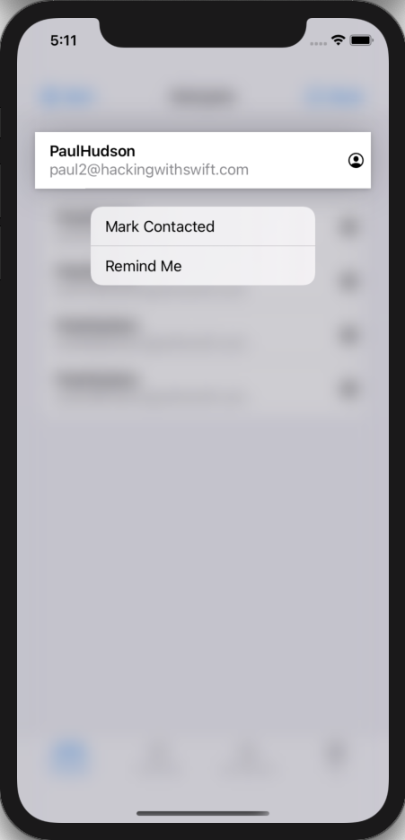
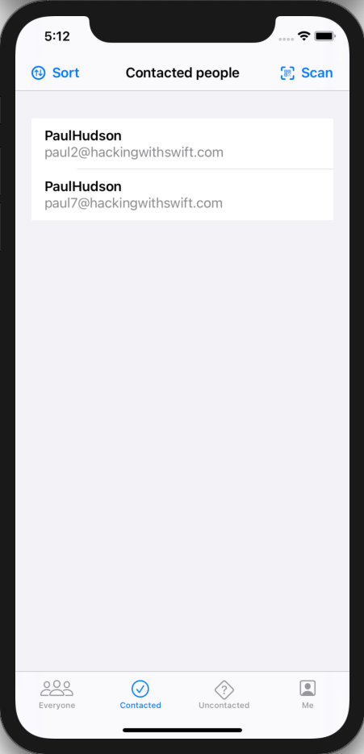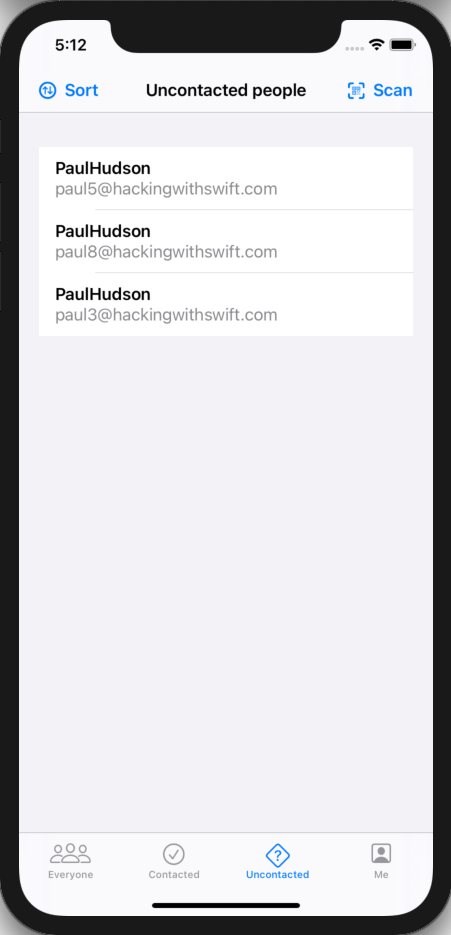
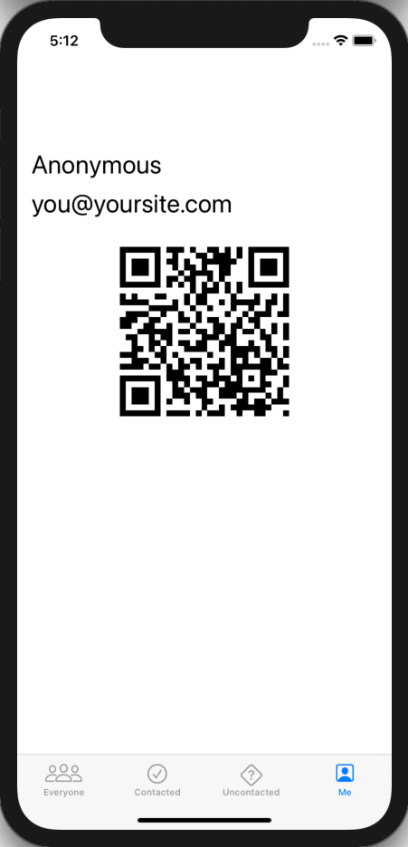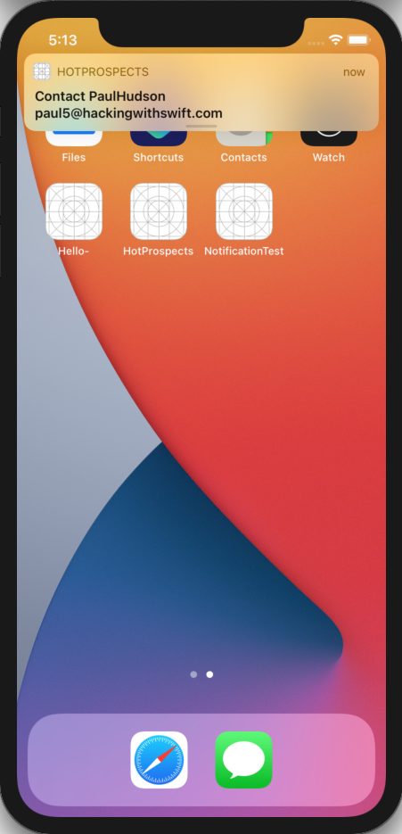
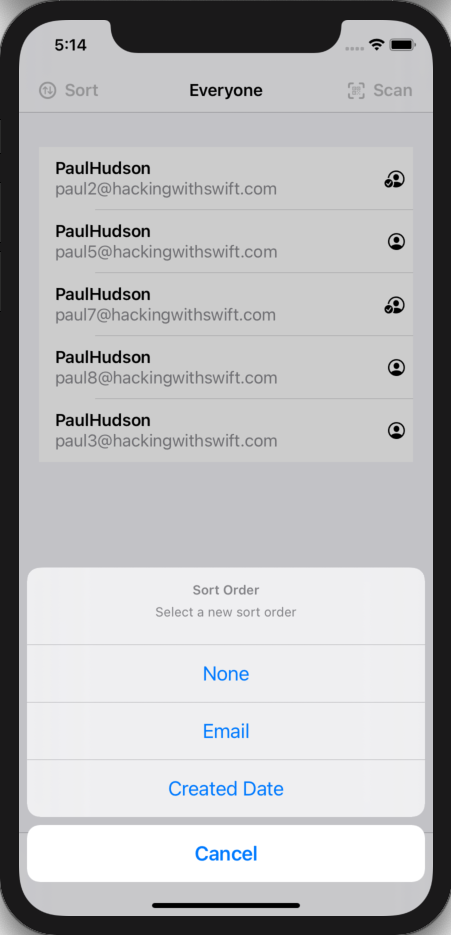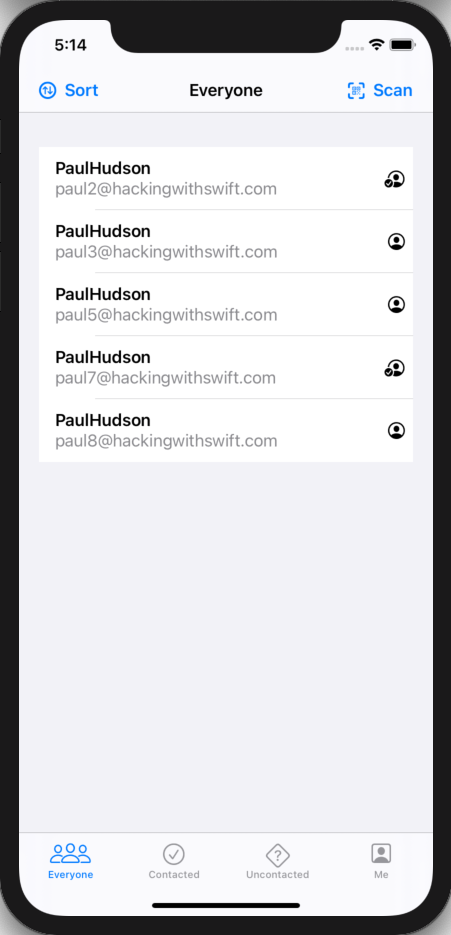